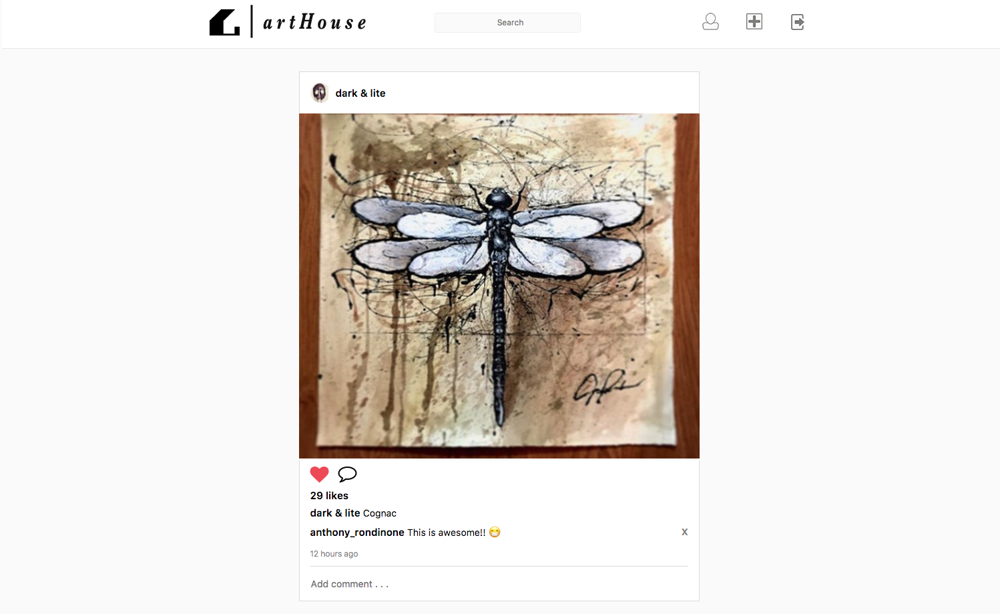
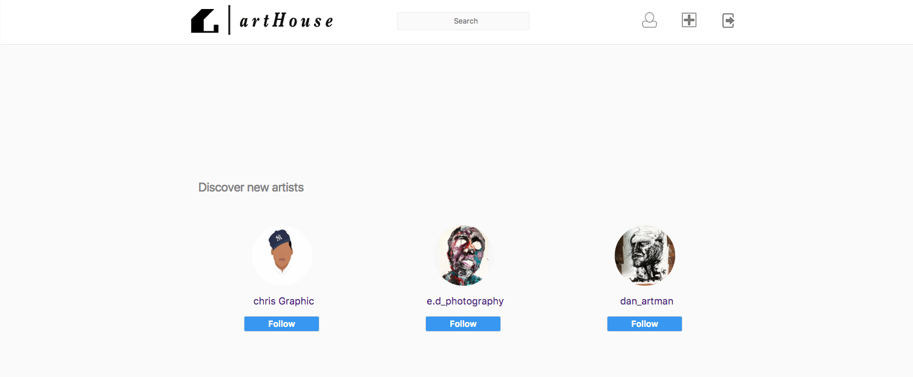
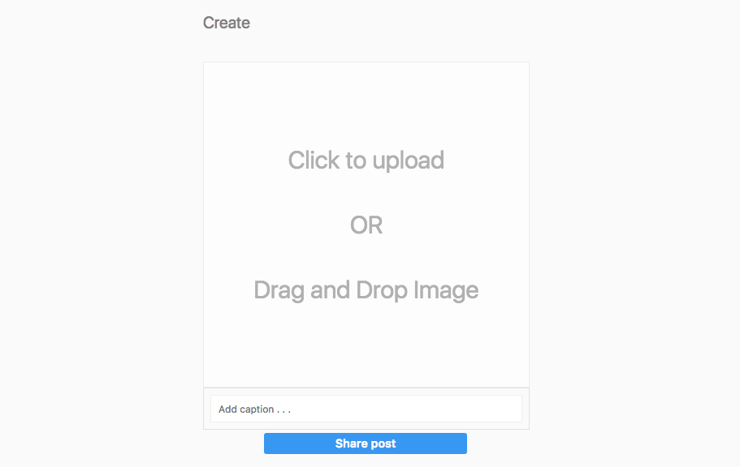

# README

# artHouse

[artHouse live][heroku]

[heroku]: https://arthouse.herokuapp.com/#/signup

artHouse is a full-stack web application modeled after Instagram.  This app is designed for artists to post their work with the social media aspect of users being able to follow artists they find, and like posts they favor.  I am planning on adding a bid or buy feature so followers can buy pieces from artists directly.  artHouse uses Ruby on Rails for the backend, a PostgreSQL database, and React/Redux architectural framework on the frontend.

## Features & Implementation

### Feed vs. Discover page

The artHouse feed only displays the current users posts and posts of artists the current user follows. On the backend I leverage associations between the users, follows, posts, comments and likes tables.  After log in, an API call is made to join the users table with follows table on `follower_id` using `.includes()` to avoid N + 1 queueing when iterating through `followed_artists` to grab all posts, map over `post_id`'s, `like_id`'s and `comment_id`'s.  Each post in the post slice of state holds arrays of their `like_id`'s and `comment_id`'s to keep a normalized state.  These id's are references when rendering each posts comment index and to persist likes.  On the front end a selector puts these post objects into an array and sorts they by the `create_at` to keep the feed in order.



When a new user signs up and is not following any artists yet, they are redirected to a welcome/Discover page instead of going to the feed so they have a chance to check out some of the top artists artHouse has to offer.  

```js
componentDidMount() {
  if (this.props.currentUser.followeeIds.length === 0) {
    this.props.history.push('/welcome');
  } else {
    this.props.importFeedPosts();
  }
}
```




### Drag & Drop image uploading with preview

Image uploads are managed using Paperclip, Amazon Web Services and react-dropzone.  Users can click or drag and drop their image to upload and add a caption.  When a user chooses an image, a preview of that image is displayed before they share which removes the dropzone.

```js

updateDraggedFile (e) {
let file = e[0];
let fileReader = new FileReader();
fileReader.onloadend = function() {
  this.setState({imageFile: file, imageURL: fileReader.result });
}.bind(this);

  if (file) {
    fileReader.readAsDataURL(file);
    $('.drag-zone').remove();
  }
}
```




### Following


The Follow/Edit button is it's own component holding logic to determine if the current user is on their own page an edit button is rendered and on a followed artist's page a follow button is rendered.  onCLick an API call is made to create a new `Follow` to be saved on the backend. On the frontend, each artist has an array of `follower_ids`.  When the user visits an artist page, if current_user.id is included in the artist's `follower_ids` array, the follow persists and the button renders as `Following` which makes an API call to destroy that `Follow`.


```js
let followState = user.followerIds.includes(currentUser.id) ? "Following" : "Follow";

switch(followState) {
  case "Following":
  return (
    <button className="editFollowing" onClick={this.handleUnfollow} >{followState}</button>
  );
  case "Follow":
  return (
    <button className="editFollow" onClick={this.handleFollow} >{followState}</button>
  );
}
```


## Future Directions for the Project


### Bid/Buy

Add a Bid/Buy button on each post which will also display the current bid of the piece.  An artist can place a minimum bid, set price, or open the piece up for all bids.  User can place a bids and 'win' the piece.

### Artist Stats

Create a stat page for each artist with graph or chart of how the artist has been selling.  If the prices of their pieces have gone up or down so users know if it's a good investment if they are looking for more then just buying a piece they like for aesthetic purposes.


### Search

Implement search for users to search by artist or hashtag.
